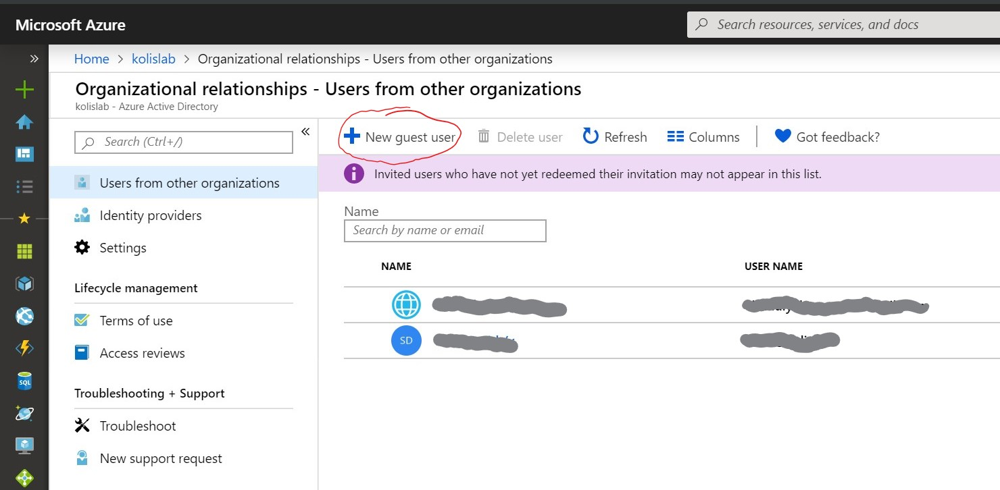

+++
author = "David Sass"
categories = ["Azure", "AzureAD", "Office365"]
date = 2019-05-11T18:20:00Z
description = ""
draft = false
slug = "azops-pro-tip-1"
tags = ["Azure", "AzureAD", "Office365"]
title = "Running Azure AD Pro Tip #1"

+++

> Set up your system in a way which will allow you to receive incoming emails.

## Use case #1: Invitations

Your users might be invited into a different Tenant to access resources. To accept these invitations - which will arrive in email form - you've to receive these invitation emails.

## Use case #2: Official communications

You might get into a situation where you want to purchase one or more HTTPS certificates to run your services with your own domain name and not just with the standard [https://something.azurewebsites.net](https://something.azurewebsites.net) [] URL.

As part of this process, the Certificate Authority will try to validate your ownership over your domain name and send you an email for confirmation. They will probably use one of these addresses:

* administrator@yourdomain.com
* hostmaster@yourdomain.com
* postmaster@yourdomain.com

> Without MX records and a system receiving these email you'll face some challenges.

## Options to receive emails

### Without your own domain name

When you're using the standard issued login names like: _john.doe@something.onmicrosoft.com_ you will have to use **Office 365** to receive emails because the MX records of _something.onmicrosoft.com_ are pointing to Office 365 and you cannot change them.

Of course you can purchase the cheapest service to receive emails because you'll only need Exchange Online licenses and nothing else.

### With your own domain name

When you're using your own domain to logon into Azure, for example: _john.doe@company.com_ and you've the control over your MX records, you can use whatever system you'd like to use to receive those emails.

You can still use Office 365 but you can also use any other emails you're currently using.

## My way of getting these emails

I have multiple subscriptions both for Azure and Office 365, I run production and developer subscriptions as well.

I use the sub-domains under my production domain to run non-production subscription so I can have the control over the email flow:

* kolislab.com for production
* dev.kolislab.com for development
* demo.kolislab.com for demo purposes

