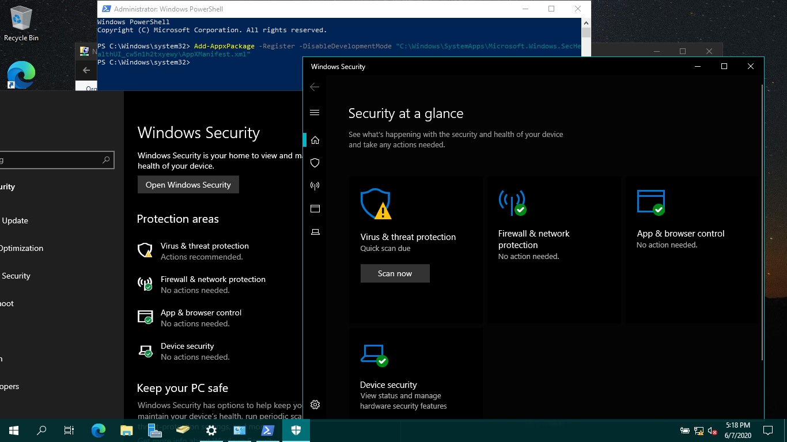

+++
author = "David Sass"
categories = ["Security", "Defender", "Server", "Windows"]
date = 2020-06-07T15:32:59Z
description = ""
draft = false
image = "defender-error.png"
slug = "defender-on-windows-server-2019"
summary = "Error message: You'll need a new app to open this windowsdefender"
tags = ["Security", "Defender", "Server", "Windows"]
title = "Windows Defender on Windows Server 2019"

+++


You might run into this error on Windows Server 2019 when trying to open Windows Defender to change/validate its settings:

> You'll need a new app to open this windowsdefender

When this happens just execute the following line in an elevated PowerShell console

```PowerShell
Add-AppxPackage -Register -DisableDevelopmentMode "C:\Windows\SystemApps\Microsoft.Windows.SecHealthUI_cw5n1h2txyewy\AppXManifest.xml"
```

And the results (I need this on two of my server in my Lab):


