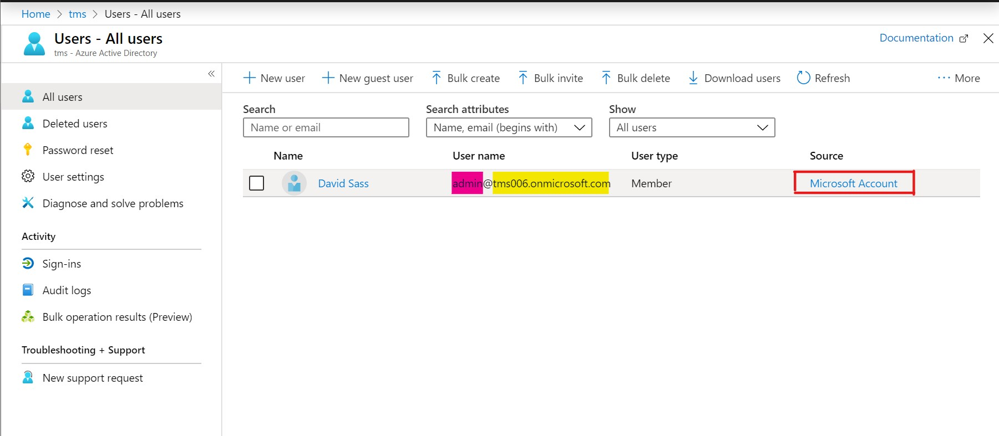
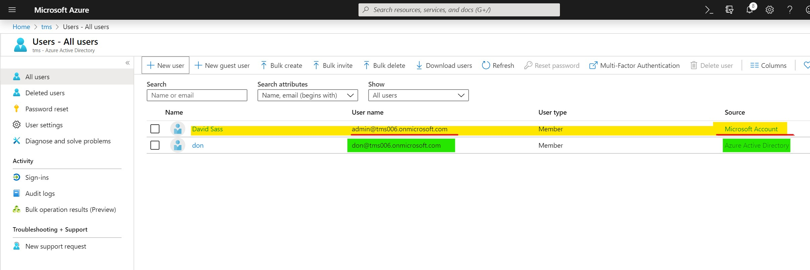

+++
author = "David Sass"
date = 2019-11-21T19:27:55Z
description = ""
draft = true
image = "Annotation-2019-11-21-211954.jpg"
slug = "how-to-delete-a-free-microsoft-teams-tenant"
title = "How to delete a Free Microsoft Teams Tenant"

+++

Sometimes you have to do some housekeeping and delete the Tenants you don't need anymore. But in some rare cases - especially with the free Microsoft Teams offering - you might run into some challenges as I did.

## Microsoft Accounts cannot access the Admin Center

Unfortunately the Microsoft Account used to subscribe for the free service is a special account which cannot access the Microsoft 365 Admin Center where the Billing and Licensing is happening, which is a huge blocker if that is the last account available in the tenant.

_I run into this situation myself when I was trying to clean up one of my test tenants._

## Workaround

The solution is to create a new temporary account, designate it as a global admin and sign-in into the [Microsoft 365 Admin center](https://admin.microsoft.com), as you can see on the picture the key is that we need an account with Azure Active Directory as source.

### Wait a couple days

After we managed to cancel, and delete our subscription we still have to wait a couple

