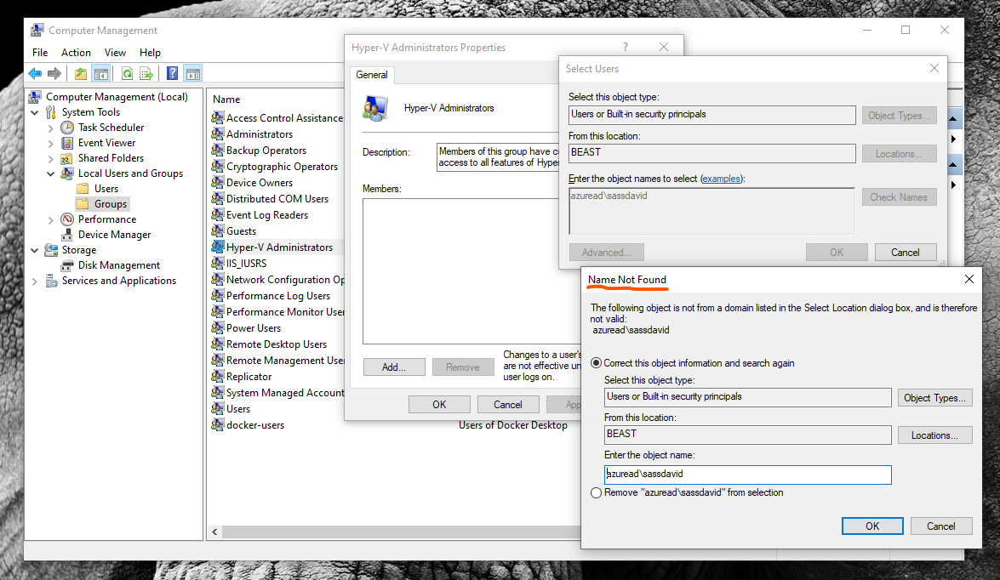
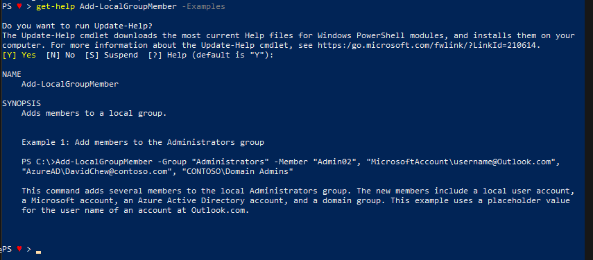

+++
author = "David Sass"
categories = ["AzureAD", "Admin", "PowerShell", "Hyper-V", "localgroup", "Local Group", "Add-LocalGroupMember"]
date = 2020-05-02T10:29:20Z
description = ""
draft = false
image = "Hyper-V-Administratiors.png"
slug = "manage-local-groups-on-azure-ad-joined-machines"
summary = "Get-VM : You do not have the required permission to complete this task. Let's fix that using Add-LocalGroupMember on our Azure AD joined device."
tags = ["AzureAD", "Admin", "PowerShell", "Hyper-V", "localgroup", "Local Group", "Add-LocalGroupMember"]
title = "How to manage Hyper-V Administrators on Azure AD joined machines"

+++

Today's blog post we'll have a look at the use case where we've an **Azure AD** joined Windows 10 device with the **Hyper-V** role installed, and we don't want to bother elevating our PowerShell console every time to manage our virtual machines. Or to put it more bluntly get rid of this error message:

To allow our user account to run the Hyper-V cmdlets, we must add the account to the **Hyper-V Administrators** local group. That's it, sound simple right?

## Our Challenge

Given that our Windows 10 machine is joined into Azure AD, our user account is not visible in Windows, we cannot just simply add the account to the Hyper-V Administrator group using the Computer Management administrative console. Let me show it to you.

First, we check our username using the good old WHOAMI command. The result in my case is `azuread\sassdavid`

Second, we try adding this user to the correct local group.

We can use the **Win+X** keyboard shortcut and select **Computer Management** from the list of menu options. In Computer Management, select System Tools > Local Users and Groups > Groups to open the list of local groups. Right click on **Hyper-V Administrators** and select Properties. Hit **Add** and search for your username. When I searched for mine by clicking to **Check Names**, I got a **Name Not Found** error:

## Solution, use PowerShell!

With some internet research, I've found this article which describes how can we manage the local **Administrators** group on Azure AD joined machines: [Assign local admins to Azure AD joined devices](https://docs.microsoft.com/en-us/azure/active-directory/devices/assign-local-admin#manually-elevate-a-user-on-a-device). You might be thinking that **Hyper-V administrators** and **Administrators** are not the same groups, but the process is the same 😉

The article says that we could use the **net.exe** application, but we're not going to do that, that's not considered a best practice in the year 2020. We're going to use PowerShell!

For reference, this is the command to run from **CMD** `net localgroup "Hyper-v Administrators" /add "AzureAD\UserUpn"`

In PowerShell we can use the `Add-LocalGroupMember` cmdlet to achieve the same results.

I'll execute the following command `Add-LocalGroupMember -Group 'Hyper-V Administrators' -Member 'azuread\sassdavid'` 

And also confirm the result using `Get-LocalGroupMember -Group 'Hyper-V Administrators'`

One more thing to do, is to check the **Hyper-V Administrators** group's properties using Computer Management and confirm that our account is there.

I hope this post will help you, happy scripting!

