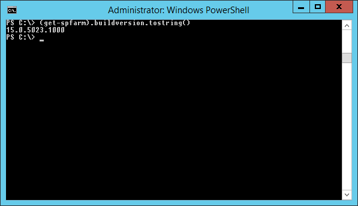
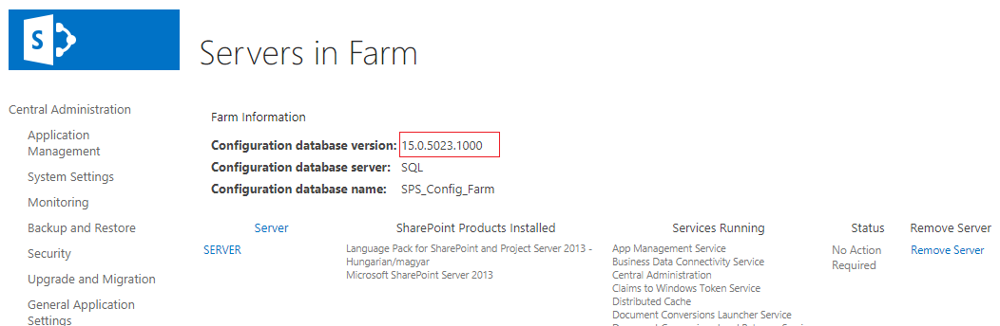
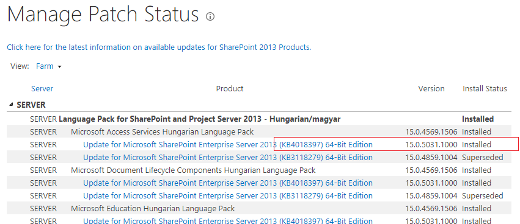

+++
author = "David Sass"
categories = ["SharePoint", "CU", "BuildVersion"]
date = 2018-07-01T10:33:00Z
description = ""
draft = false
slug = "sharepoint-2013-may-2018-cu"
tags = ["SharePoint", "CU", "BuildVersion"]
title = "SharePoint 2013 - May 2018 CU"

+++


After installing the **May 2018 CU** on my **SharePoint Server 2013** Developer box I was expecting to see the official Build Number ```15.0.5031.1001``` but I got something else as a result:


Weird. ```15.0.5023.1000``` is the Build Number of the **April 2018 CU**.

I was thinking

  - Have I installed the correct CU?
  - I did, it was the ```ubersrv2013-kb4018397-fullfile-x64-glb.exe```
  - Lets check the Central Admin
  - The same version number:



OK. I have seen some weird stuff with SharePoint during these last years.

Finally I have found the correct Build Numbers on the *Chech product and patch installation status* page:




