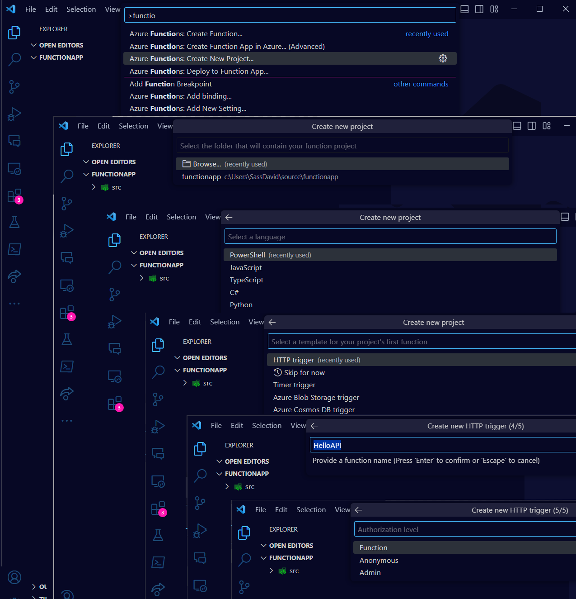

+++
title = "Ultimate Functions App API Guide"
description = "PowerShell based APIs hosted as Function App accessed securely"
date = "2024-02-05T23:03:12.911Z"
preview = ""
draft = true
tags = [ ]
categories = [ "Azure", "FunctionApp", "PowerShell", "API" ]
slug = "ultimate-functions-app-api-guide"
+++

# Ultimate Functions App API Guide

This is a guide to create a Function App with PowerShell based APIs and secure access to the APIs.

> !IMPORTANT: You can enforce Authentication on two levels, sometimes in the same time, and that can drive you mad. So, hangin' there!

## Prerequisites

To make the most of this guide, you should have the following components installed/available for you:

- Azure Subscription
- Visual Studio Code
- Azure Functions Extension for Visual Studio Code
- Azure Functions Core Tools
- PowerShell 7
- MSAL.PS Module for PowerShell

> The guide is written for Windows, but you can use the same steps on Linux or macOS.

## Step by step

Let's open our ideally empty folder in Visual Studio Code and create a new Function App.

I prefer to have a `src` folder for the source code, but this is optional. If you want to have it, create it now.

The creation of the project is a 5 steps process, which starts with pressing `Ctrl+Shift+P` and typing `Azure Functions: Create New Project`:

1. Select a folder for the project
1. Select the language, chose: `PowerShell`
1. Select a template for the first function, chose: `HTTP trigger`
1. Give a name for the function, I gave `HelloAPI` as we are starting with a simple API
1. Select the authorization level, chose: `Function`

The project is created, and the first function is ready to be deployed. But before we do that, let's add some code to the function.
